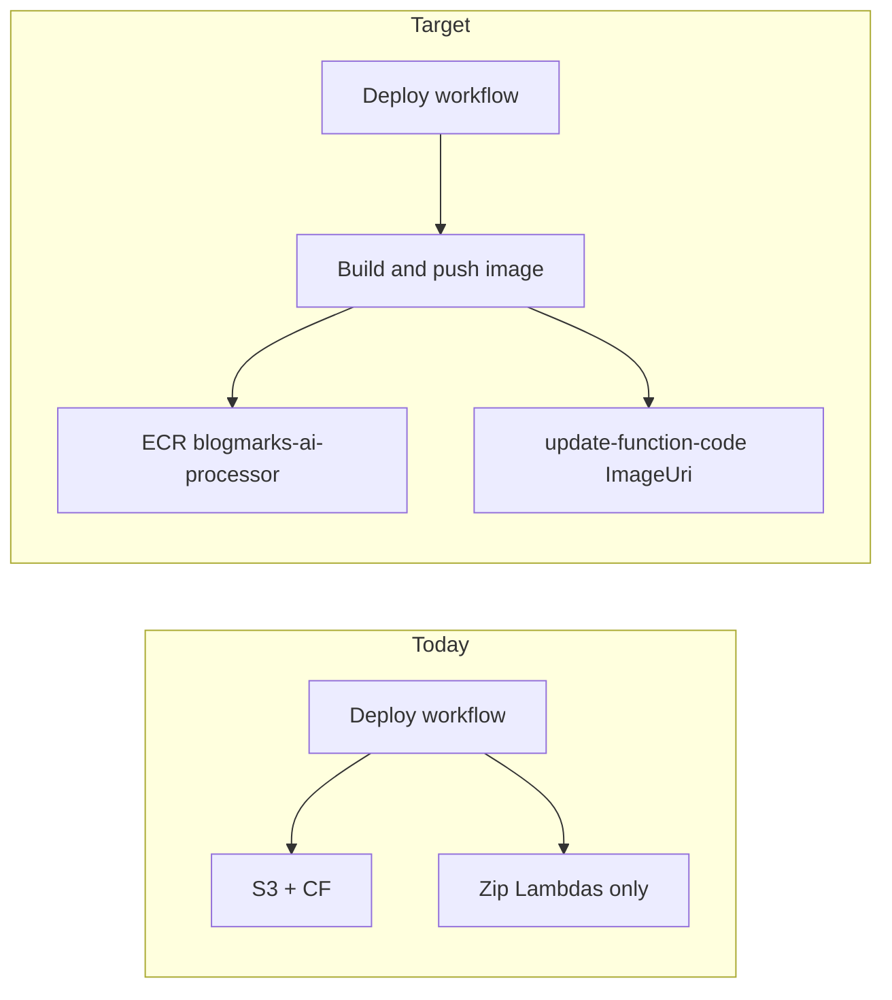

# Automate blogmarks-ai-processor container deploy

## Current gap

- [`.github/workflows/deploy.yml`](https://github.com/kayaman/Projects/blogmarks/blob/main/.github/workflows/deploy.yml) ends after zip-based Lambdas; no Docker/ECR steps.
- The deploy IAM policy in [`terraform/main.tf`](https://github.com/kayaman/Projects/blogmarks/terraform/main.tf) (`data.aws_iam_policy_document.deploy`, ~339–382) lists `lambda:UpdateFunctionCode` only for **specific** function ARNs and **excludes** `aws_lambda_function.ai_processor`. It also has **no ECR** statements, so the existing `AWS_ACCESS_KEY_ID` user cannot push images even if you add shell commands.

## 1. Terraform: IAM for deploy user

In [`terraform/main.tf`](https://github.com/kayaman/Projects/blogmarks/terraform/main.tf), extend `data.aws_iam_policy_document.deploy`:

1. **Lambda** — Add `aws_lambda_function.ai_processor.arn` to the `LambdaDeploy` statement’s `resources` list so `lambda:UpdateFunctionCode` and `lambda:GetFunction` apply to `blogmarks-ai-processor`.

2. **ECR** — Add two statements (standard push pattern):
   - `ecr:GetAuthorizationToken` on `*` (AWS requirement for registry login).
   - Push/pull layer APIs on the ai-processor repo only, e.g. `resources = [aws_ecr_repository.ai_processor.arn]` with actions such as `ecr:BatchCheckLayerAvailability`, `ecr:CompleteLayerUpload`, `ecr:InitiateLayerUpload`, `ecr:PutImage`, `ecr:UploadLayerPart`, and (often needed) `ecr:BatchGetImage` / `ecr:GetDownloadUrlForLayer` for layer checks.

After merge, **apply Terraform** once from your operator account so `blogmarks-deploy` picks up the new policy (same as any other IAM change).

## 2. GitHub Actions: build, push, update Lambda

Extend [`.github/workflows/deploy.yml`](https://github.com/kayaman/Projects/blogmarks/.github/workflows/deploy.yml) (or add a dedicated workflow that reuses the same triggers/secrets—single file is simpler to maintain).

**Recommended shape:**

- Add a **paths-filter** job (e.g. `dorny/paths-filter@v3`) so downstream work runs when `lambda/ai-processor/**` or the workflow file changes. Optionally add `workflow_dispatch` with an input like `force_ai_processor: boolean` to rebuild the image without touching that folder (useful for base-image or dependency-only experiments).

- Add job **`deploy-ai-processor`** (depends on filter + same `push` to `main`):
  - `runs-on: ubuntu-latest`
  - Reuse [`aws-actions/configure-aws-credentials@v4`](https://github.com/aws-actions/configure-aws-credentials) with the same `secrets.AWS_*` as the main deploy job (`us-east-1`).
  - **Login to ECR:** `aws ecr get-login-password --region us-east-1 | docker login --username AWS --password-stdin <account>.dkr.ecr.us-east-1.amazonaws.com`  
    Account ID can come from a repo **variable** (e.g. `AWS_ACCOUNT_ID`) or `aws sts get-caller-identity --query Account --output text` in the job.
  - **Build:** `docker build -t blogmarks-ai-processor lambda/ai-processor` (context matches [`lambda/ai-processor/Dockerfile`](https://github.com/kayaman/Projects/blogmarks/lambda/ai-processor/Dockerfile)).
  - **Tag and push:** Tag with `${{ github.sha }}` (traceability) and `latest`; push both to `${ECR_REPOSITORY_URI}` matching Terraform output [`ecr_repository_uri`](https://github.com/kayaman/Projects/blogmarks/terraform/ecr.tf) (e.g. store full URI as GitHub repo variable `ECR_AI_PROCESSOR_URI` to avoid guessing account ID in YAML).
  - **Update Lambda:**  
    `aws lambda update-function-code --function-name blogmarks-ai-processor --image-uri <uri>:${{ github.sha }} --region us-east-1`  
    Prefer **SHA tag** on the function so the running revision is immutable; keep `latest` in ECR for ad-hoc use.

**Prerequisite (document in [AGENTS.md](https://github.com/kayaman/Projects/blogmarks/AGENTS.md)):** `var.ai_processor_image_uri` must be non-empty in `terraform.tfvars` so the Lambda is **Image** package type. `update-function-code --image-uri` fails on zip-only functions.

## 3. Docs

Update [AGENTS.md](https://github/kayaman/Projects/blogmarks/AGENTS.md) “Build and push ai-processor container image” section: normal path is CI on push to `main`; manual Docker/ECR steps remain as break-glass / local testing. Note the new GitHub variable(s) and one-time Terraform apply for IAM.

## 4. Verification

- Open a PR that only touches `lambda/ai-processor/` (or `workflow_dispatch` with force flag): confirm job runs, image appears in ECR, Lambda configuration shows new image digest.
- Push that only changes frontend: confirm filter **skips** the image job (saves minutes and ECR churn).
- Confirm deploy user cannot push to other ECR repos (policy scoped to `aws_ecr_repository.ai_processor` only).

## Alternatives (not default)

- **Build on every main push** (no path filter): simplest mentally, slower and churns ECR lifecycle on unrelated commits.
- **OIDC role** instead of access keys for this job: better long-term; larger change (new role + trust policy + workflow `permissions: id-token: write`). Can be a follow-up.
