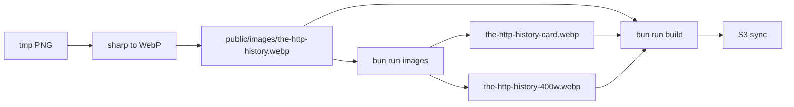

# HTTP history cover image + magj-dev release

## Context

- The post lives in [magj-dev](https://github.com/kayaman/magj-dev) at [`/home/kayaman/Projects/magj-dev/src/content/blog/the-http-history.md`](file:///home/kayaman/Projects/magj-dev/src/content/blog/the-http-history.md). Its hero/cover is **`coverImage: /images/the-http-history.webp`** (served from [`public/images/the-http-history.webp`](file:///home/kayaman/Projects/magj-dev/public/images/the-http-history.webp)).
- The new asset is **[`tmp/Gemini_Generated_Image_l982v4l982v4l982 (3).png`](file:///home/kayaman/Projects/magj-dev/tmp/Gemini_Generated_Image_l982v4l982v4l982%20(3).png)** (~8.5 MB). This is the cover replacement only; inline figures under `public/images/the-http-history/` stay as they are unless you ask to change them too.

## Implementation steps

1. **Produce the new canonical cover WebP** (overwrite existing):
   - Use **sharp** (already a dependency in [`package.json`](file:///home/kayaman/Projects/magj-dev/package.json)) to read the PNG and write `public/images/the-http-history.webp` with sensible quality (e.g. 80–85) and optional max width (e.g. 1600–1920) if the source is very large, to keep the hero lean for web.
   - Do **not** commit the raw `tmp/*.png` unless you explicitly want it in the repo; only the files under `public/images/` need to be versioned.

2. **Regenerate responsive variants** (required by the site pipeline):
   - Run `bun run images` — [`scripts/process-images.ts`](file:///home/kayaman/Projects/magj-dev/scripts/process-images.ts) rebuilds **`the-http-history-card.webp`** and **`the-http-history-400w.webp`** from the base WebP when the source is newer.

3. **Touch post frontmatter**:
   - Set **`updatedAt`** to the ship date (2026-04-04) in [`the-http-history.md`](file:///home/kayaman/Projects/magj-dev/src/content/blog/the-http-history.md).
   - Adjust **`coverImageCaption`** only if the new art no longer matches the current caption.

4. **Semver patch release (content/asset change)**:
   - Bump **`version`** in [`package.json`](file:///home/kayaman/Projects/magj-dev/package.json) (currently `0.64.2`) by **PATCH** → `0.64.3`.
   - Add a bullet under **## Unreleased** in [`CHANGELOG.md`](file:///home/kayaman/Projects/magj-dev/CHANGELOG.md) describing the new HTTP history cover art.

5. **Verify locally** (matches [.github/workflows/deploy logic](file:///home/kayaman/Projects/magj-dev/.github/workflows/deploy.yaml)):
   - `bun run lint`
   - `bun run test`
   - `bun run build`

6. **Git / GitHub / production**:
   - Branch, commit (signed if your repo requires it), push, open PR with a short summary.
   - Merge to **`main`** after review; **Deploy** runs on push to `main` (lint → test → build → S3 sync → CloudFront invalidation per workflow).
   - Monitor `gh run list` / `gh run view` until deploy succeeds.
   - Create **annotated tag** `v0.64.3` and **`gh release create v0.64.3`** with notes aligned to the changelog.
   - Spot-check **https://magj.dev** (or your canonical URL) for the HTTP history post: grid card, post header, and social/OG preview if applicable.

## Notes

- Work runs in **`/home/kayaman/Projects/magj-dev`** (not in the current Cursor workspace roots `skills` / `blogmarks`); open that folder or run commands there.
- **Terraform**: Only needed if IAM or infra changed; a static image swap + frontmatter update typically does **not** require `terraform apply`.

