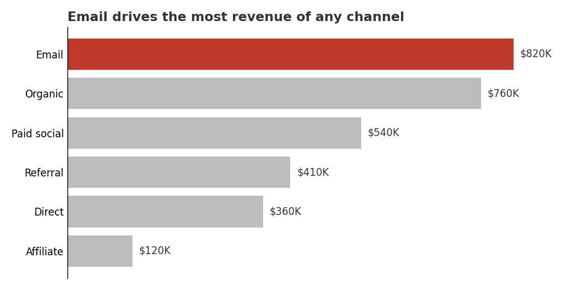
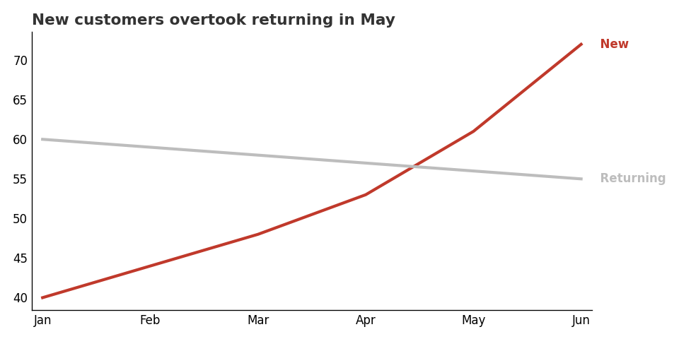
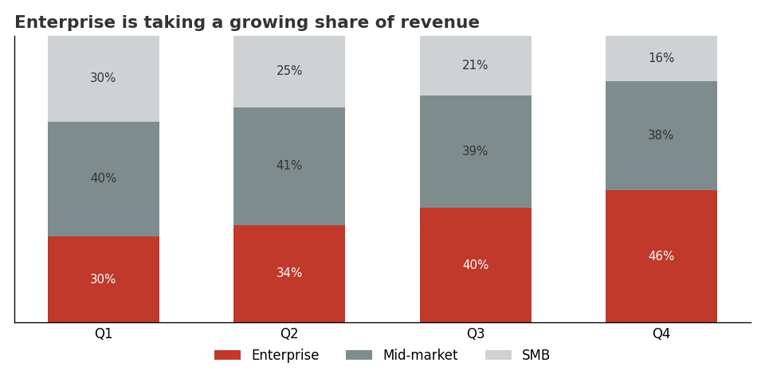
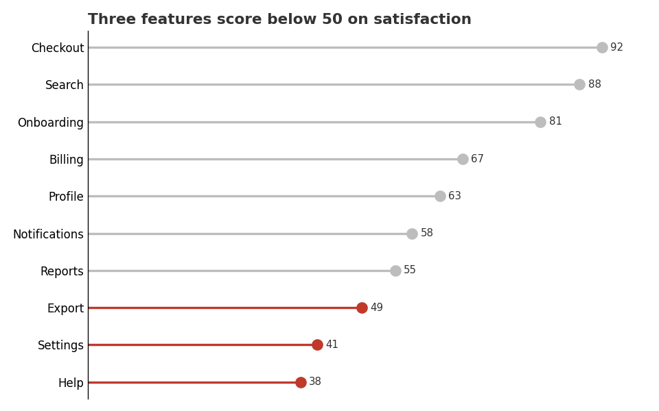
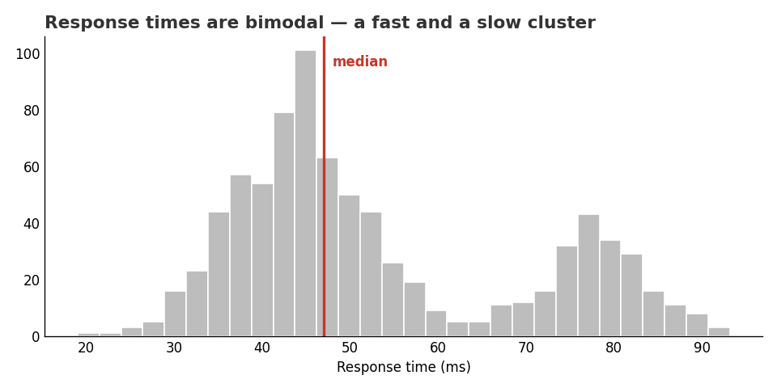
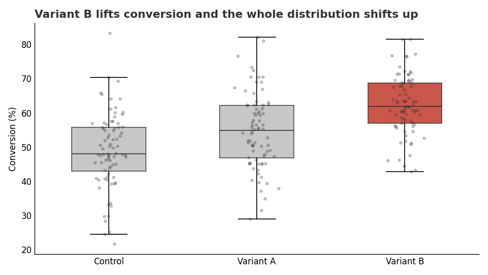
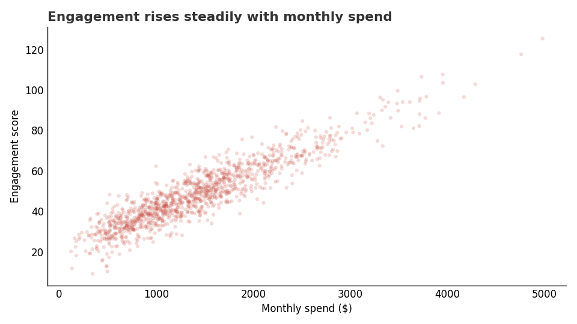
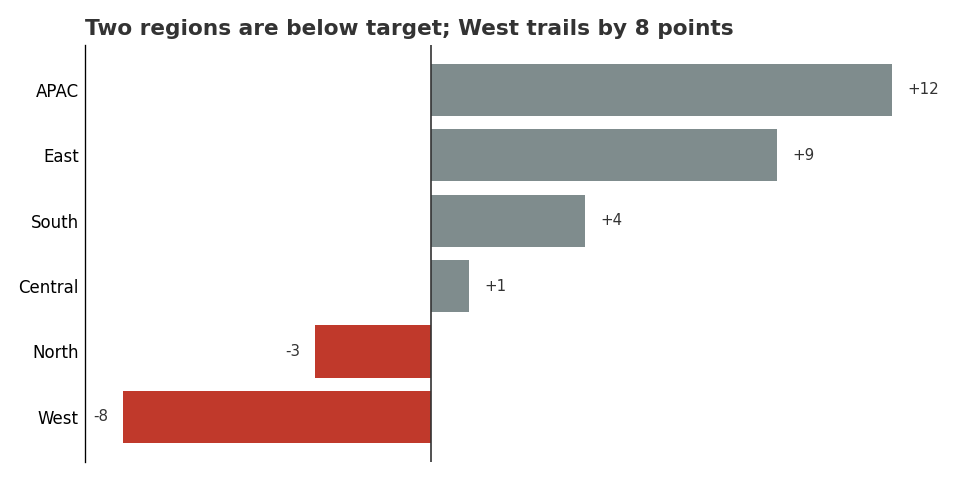

# Chart Gallery — the right chart per situation

Worked examples for the most common business-analytics situations. Each entry gives the
**situation**, the **recommended chart**, the **theory** (why that encoding, tied to the accuracy
ranking in [perception-and-encoding.md](perception-and-encoding.md)), the **common mistake**, a
**rendered example**, and the **exact code** that produced it.

Every example applies the skill's own defaults — grey by default with a single highlight color,
zero baseline for bars, direct labels over legends, decluttered spines, and a takeaway title (see
[decluttering-and-integrity.md](decluttering-and-integrity.md) and
[storytelling.md](storytelling.md)). The images are reproducible: all are generated by
[../assets/gallery/render_gallery.py](../assets/gallery/render_gallery.py); the code under each
entry is that file's function (the save path simplified to the current directory). Every snippet
below has been run as shown — paste the shared setup, then the function, then call it.

Pick the situation that matches your question (the intent taxonomy in
[chart-selection.md](chart-selection.md) maps the same nine intents).

## Shared setup

Every snippet below assumes these imports and one small styling helper (the decluttering applied to
every chart). The per-situation code follows.

```python
import matplotlib
matplotlib.use("Agg")            # headless rendering to a file
import matplotlib.pyplot as plt
import numpy as np

GREY, ACCENT, INK = "#bdbdbd", "#c0392b", "#333333"

def style(ax, title, drop=("top", "right")):
    for s in drop:
        ax.spines[s].set_visible(False)
    ax.tick_params(length=0)
    ax.set_title(title, loc="left", fontsize=13, weight="bold", color=INK)
```

---

## 1. Compare values across categories

- **Situation:** "Which channel/region/product is biggest?" Comparing one quantity across a handful
  of named categories.
- **Chart:** sorted **horizontal bar**.
- **Why:** bars encode magnitude as *length on a common scale* — rank 1 in the perception ranking,
  the most accurately read channel. Horizontal keeps long category labels readable; sorting by value
  lets the eye rank without arithmetic.
- **Common mistake:** alphabetical (or arbitrary) order; a pie chart (forces angle/area comparison);
  vertical bars with rotated, hard-to-read labels.



```python
def comparison_bar():
    cats = ["Email", "Organic", "Paid social", "Referral", "Direct", "Affiliate"]
    rev = [820, 760, 540, 410, 360, 120]  # $K
    order = np.argsort(rev)               # ascending -> largest on top in barh
    cats = [cats[i] for i in order]
    rev = [rev[i] for i in order]
    colors = [ACCENT if c == "Email" else GREY for c in cats]
    fig, ax = plt.subplots(figsize=(8, 4))
    ax.barh(cats, rev, color=colors)
    ax.set_xlim(0, max(rev) * 1.12)       # bars start at zero
    for y, v in enumerate(rev):
        ax.text(v + 12, y, f"${v}K", va="center", fontsize=10, color=INK)
    ax.set_xticks([])
    style(ax, "Email drives the most revenue of any channel", drop=("top", "right", "bottom"))
    fig.tight_layout(); fig.savefig("comparison-bar.png", dpi=120)
```

---

## 2. Change over time

- **Situation:** a metric tracked across time; you want the trend and any crossover.
- **Chart:** **line**, time on x, one line per series, **labeled at the end** instead of a legend.
- **Why:** the eye reads *slope/position* between adjacent points, so a line makes rate-of-change
  visible. Direct end-labels remove the legend round-trip. Choose the y-range honestly — a line
  axis need not start at zero (forcing zero can flatten a real trend), but don't cherry-pick either.
- **Common mistake:** too many lines ("spaghetti" — use small multiples past ~5); markers on every
  point adding clutter; forcing a zero baseline that hides the movement.



```python
def trend_line():
    months = ["Jan", "Feb", "Mar", "Apr", "May", "Jun"]
    series = {"New": [40, 44, 48, 53, 61, 72], "Returning": [60, 59, 58, 57, 56, 55]}
    fig, ax = plt.subplots(figsize=(8, 4))
    for name, vals in series.items():
        color = ACCENT if name == "New" else GREY
        ax.plot(months, vals, lw=2.5, color=color)
        ax.text(len(months) - 0.9, vals[-1], f"  {name}", va="center", color=color, weight="bold")
    ax.margins(x=0.02)
    style(ax, "New customers overtook returning in May")
    fig.tight_layout(); fig.savefig("trend-line.png", dpi=120)
```

---

## 3. Part-to-whole / composition

- **Situation:** how a total breaks into parts, and how that mix shifts over time.
- **Chart:** **stacked bar** (or 100% stacked for share). Label segments directly.
- **Why:** the bottom segment sits on a common baseline (read accurately); stacking keeps the whole
  visible. It beats a pie because you can compare across several totals at once.
- **Common mistake:** a pie (or worse, 3-D pie) with many slices — angle and area sit near the
  bottom of the accuracy ranking; stacking *many* series so the upper ones float on jagged baselines
  (only the bottom is easy to read — if every series matters, use small multiples).



```python
def part_to_whole():
    quarters = ["Q1", "Q2", "Q3", "Q4"]
    seg = {"Enterprise": [30, 34, 40, 46], "Mid-market": [40, 41, 39, 38], "SMB": [30, 25, 21, 16]}
    palette = {"Enterprise": ACCENT, "Mid-market": "#7f8c8d", "SMB": "#cfd2d4"}
    fig, ax = plt.subplots(figsize=(8, 4))
    bottom = np.zeros(len(quarters))
    for name, vals in seg.items():
        ax.bar(quarters, vals, bottom=bottom, color=palette[name], width=0.6, label=name)
        for i, v in enumerate(vals):                       # direct in-segment labels
            ax.text(i, bottom[i] + v / 2, f"{v}%", ha="center", va="center",
                    color="white" if name == "Enterprise" else INK, fontsize=9)
        bottom += np.array(vals)
    ax.set_ylim(0, 100); ax.set_yticks([])
    ax.legend(loc="upper center", bbox_to_anchor=(0.5, -0.05), ncol=3, frameon=False)
    style(ax, "Enterprise is taking a growing share of revenue")
    fig.tight_layout(); fig.savefig("part-to-whole.png", dpi=120)
```

---

## 4. Rank items

- **Situation:** ordering many items best-to-worst (10+), e.g. feature scores, store performance.
- **Chart:** ordered **lollipop / dot plot**.
- **Why:** it encodes value by *position on a common scale* (rank 1) like a bar, but uses far less
  ink — better when there are many rows. Sorting is the whole point; the highlight marks the items
  that cross a threshold.
- **Common mistake:** leaving items unsorted; using heavy bars that create a wall of ink for many
  categories.



```python
def ranking_lollipop():
    items = ["Checkout", "Search", "Onboarding", "Billing", "Profile",
             "Notifications", "Reports", "Export", "Settings", "Help"]
    score = [92, 88, 81, 67, 63, 58, 55, 49, 41, 38]
    order = np.argsort(score)
    items = [items[i] for i in order]; score = [score[i] for i in order]
    colors = [ACCENT if s < 50 else GREY for s in score]
    fig, ax = plt.subplots(figsize=(8, 5))
    ax.hlines(items, 0, score, color=colors, lw=2)
    ax.plot(score, items, "o", color="none")   # fix categorical y-order before drawing dots
    for i, (s, c) in enumerate(zip(score, colors)):
        ax.plot(s, i, "o", color=c, ms=9)
        ax.text(s + 1.5, i, str(s), va="center", fontsize=9, color=INK)
    ax.set_xlim(0, 100); ax.set_xticks([])
    style(ax, "Three features score below 50 on satisfaction", drop=("top", "right", "bottom"))
    fig.tight_layout(); fig.savefig("ranking-lollipop.png", dpi=120)
```

---

## 5. Distribution of one variable

- **Situation:** the shape of a single numeric variable — center, spread, skew, multiple modes.
- **Chart:** **histogram** (annotate the median or another reference).
- **Why:** binning reveals shape a summary statistic hides — here a bimodal "fast vs slow" split a
  single average would mask. Bin width is a real choice: too few hides structure, too many shows
  noise.
- **Common mistake:** reporting only a bar-of-means (hides the spread entirely); leaving the bin
  count at a default that obscures the shape.



```python
def distribution_histogram():
    rng = np.random.default_rng(7)
    data = np.concatenate([rng.normal(45, 8, 600), rng.normal(78, 6, 220)])  # bimodal
    fig, ax = plt.subplots(figsize=(8, 4))
    ax.hist(data, bins=30, color=GREY, edgecolor="white")
    ax.axvline(float(np.median(data)), color=ACCENT, lw=2)
    ax.text(float(np.median(data)) + 1, ax.get_ylim()[1] * 0.9, "median",
            color=ACCENT, weight="bold")
    ax.set_xlabel("Response time (ms)")
    style(ax, "Response times are bimodal — a fast and a slow cluster")
    fig.tight_layout(); fig.savefig("distribution-histogram.png", dpi=120)
```

---

## 6. Compare distributions across groups

- **Situation:** comparing the spread of a metric across a few groups (e.g. A/B/n test arms).
- **Chart:** **box plot** (or violin) with **jittered raw points** overlaid.
- **Why:** boxes summarize median and quartiles; the jittered points show sample size and outliers
  the box hides. Together they show that a "winner" shifts the *whole* distribution, not just the
  mean.
- **Common mistake:** the "dynamite" bar-with-error-bar — it shows two numbers (mean, SE) and hides
  the distribution, overstating how separated the groups are.



```python
def distribution_box():
    rng = np.random.default_rng(3)
    groups = ["Control", "Variant A", "Variant B"]
    data = [rng.normal(m, s, n) for m, s, n in [(50, 10, 80), (54, 11, 80), (62, 9, 80)]]
    fig, ax = plt.subplots(figsize=(8, 4.5))
    bp = ax.boxplot(data, vert=True, patch_artist=True, widths=0.5,
                    medianprops=dict(color=INK), showfliers=False)
    for i, box in enumerate(bp["boxes"]):
        box.set(facecolor=ACCENT if i == 2 else GREY, edgecolor=INK, alpha=0.85)
    for i, d in enumerate(data):                        # jittered raw points
        x = rng.normal(i + 1, 0.05, len(d))
        ax.plot(x, d, "o", ms=3, color=INK, alpha=0.25)
    ax.set_xticks([1, 2, 3]); ax.set_xticklabels(groups)
    ax.set_ylabel("Conversion (%)")
    style(ax, "Variant B lifts conversion and the whole distribution shifts up")
    fig.tight_layout(); fig.savefig("distribution-box.png", dpi=120)
```

---

## 7. Relationship between two measures

- **Situation:** do two numeric variables move together?
- **Chart:** **scatter plot**. With many points, fight overplotting with transparency (`alpha`),
  hexbin, or sampling.
- **Why:** position on *two* common scales is the most accurate way to show a bivariate
  relationship. Transparency turns a black blob into visible density.
- **Common mistake:** opaque markers that hide density at scale; adding a trend line and then
  describing the relationship as *causal* — correlation is not causation, so keep the claim to what
  the data supports.



```python
def relationship_scatter():
    rng = np.random.default_rng(11)
    x = rng.gamma(4, 350, 1200)
    y = 20 + 0.02 * x + rng.normal(0, 6, 1200)
    fig, ax = plt.subplots(figsize=(8, 4.5))
    ax.scatter(x, y, s=14, color=ACCENT, alpha=0.18, edgecolors="none")  # alpha for overplot
    ax.set_xlabel("Monthly spend ($)"); ax.set_ylabel("Engagement score")
    style(ax, "Engagement rises steadily with monthly spend")
    fig.tight_layout(); fig.savefig("relationship-scatter.png", dpi=120)
```

---

## 8. Deviation from a target

- **Situation:** how far each item sits above or below a reference (target, budget, prior period).
- **Chart:** **diverging bar** around a zero/reference line, sorted.
- **Why:** anchoring bars at the reference turns "above/below" into direction and length — instantly
  readable — instead of asking the reader to subtract from a target line. Color separates the two
  sides; the highlight marks the misses.
- **Common mistake:** plotting absolute values as ordinary bars with the target as a faint line, so
  the reader has to compute each gap; not sorting, so the pattern is lost.



```python
def deviation_diverging():
    regions = ["West", "North", "Central", "South", "East", "APAC"]
    delta = [-8, -3, 1, 4, 9, 12]   # percentage points vs target
    order = np.argsort(delta)
    regions = [regions[i] for i in order]; delta = [delta[i] for i in order]
    colors = [ACCENT if d < 0 else "#7f8c8d" for d in delta]
    fig, ax = plt.subplots(figsize=(8, 4))
    ax.barh(regions, delta, color=colors)
    ax.axvline(0, color=INK, lw=1)
    for y, d in enumerate(delta):
        ax.text(d + (0.4 if d >= 0 else -0.4), y, f"{d:+d}", va="center",
                ha="left" if d >= 0 else "right", fontsize=9, color=INK)
    ax.set_xticks([])
    style(ax, "Two regions are below target; West trails by 8 points",
          drop=("top", "right", "bottom"))
    fig.tight_layout(); fig.savefig("deviation-diverging.png", dpi=120)
```

---

## Reproduce the gallery

```bash
cd assets/gallery && python3 render_gallery.py   # writes all PNGs next to the script
```

Sources: the chart families follow Wilke *Fundamentals of Data Visualization* and the FT Visual
Vocabulary lineage (via Kirk); the encoding rationale is Cleveland & McGill (see
perception-and-encoding.md); the formatting defaults are Knaflic, Few, and Tufte (see
decluttering-and-integrity.md and storytelling.md).
