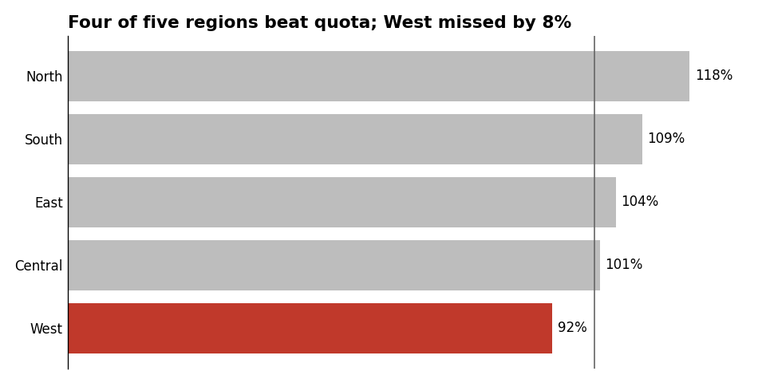

# Python Recipes

Optional appendix: how to *apply* the principles in code. The principles (chart selection,
encoding, color, decluttering, integrity) are the point — these recipes just show them realized in
the most common Python tools. Defaults shown here bake in the guidance from the other reference
files. Adapt the ecosystem to your stack; the design decisions transfer to R/ggplot, Tableau, or
JavaScript unchanged.

> Why these defaults: each annotated choice traces to a principle. Sorted bars + zero baseline +
> length encoding = accurate magnitude comparison; grey-by-default + one highlight = preattentive
> emphasis; viridis = perceptually uniform & colorblind-safe; direct labels = no legend ping-pong;
> takeaway title = the chart carries its own message.

## matplotlib — the "good" bar chart from SKILL.md

Realizes the worked example: sorted horizontal bars, zero baseline, one region highlighted, direct
labels, takeaway title, decluttered frame. Running this verbatim produces
[assets/example-quota-bar.png](../assets/example-quota-bar.png):



```python
import matplotlib.pyplot as plt

regions = ["North", "South", "East", "Central", "West"]
pct_of_quota = [118, 109, 104, 101, 92]   # West missed

# Sort by value (ranking intent) — ascending so the top bar is largest in a horizontal chart.
order = sorted(range(len(regions)), key=lambda i: pct_of_quota[i])
regions = [regions[i] for i in order]
pct_of_quota = [pct_of_quota[i] for i in order]

# Grey by default; highlight only the exception (preattentive emphasis).
colors = ["#c0392b" if v < 100 else "#bdbdbd" for v in pct_of_quota]

fig, ax = plt.subplots(figsize=(8, 4))            # aspect chosen, not default
ax.barh(regions, pct_of_quota, color=colors)
ax.axvline(100, color="#666666", lw=1)            # reference line at quota
ax.set_xlim(0, max(pct_of_quota) * 1.1)           # bars MUST start at zero

# Direct labels instead of an x-axis + gridlines.
for y, v in enumerate(pct_of_quota):
    ax.text(v + 1, y, f"{v}%", va="center", fontsize=10)

# Declutter: drop frame, ticks, redundant axis.
for side in ("top", "right", "bottom"):
    ax.spines[side].set_visible(False)
ax.tick_params(length=0)
ax.set_xticks([])

# Title = takeaway (a sentence), not a label.
ax.set_title("Four of five regions beat quota; West missed by 8%",
             loc="left", fontsize=13, weight="bold")
fig.tight_layout()
fig.savefig("../assets/example-quota-bar.png", dpi=120)
```

## matplotlib — line chart, honest baseline, direct end-labels

```python
import matplotlib.pyplot as plt

months = ["Jan", "Feb", "Mar", "Apr", "May", "Jun"]
series = {"Product A": [40, 42, 45, 47, 52, 58],
          "Product B": [60, 58, 55, 50, 44, 39]}

fig, ax = plt.subplots(figsize=(8, 4))
for name, vals in series.items():
    ax.plot(months, vals, lw=2)
    ax.text(len(months) - 1 + 0.1, vals[-1], name, va="center")  # label at line end, no legend

# Line charts encode slope/position: a non-zero baseline is legitimate here.
# (A bar chart of the same data would have to start at zero.)
for side in ("top", "right"):
    ax.spines[side].set_visible(False)
ax.set_title("Product A overtook Product B in May", loc="left", weight="bold")
fig.tight_layout()
```

## matplotlib — sequential color done right (viridis, not jet)

```python
import matplotlib.pyplot as plt
import numpy as np

data = np.random.default_rng(0).random((10, 10))
fig, ax = plt.subplots()
im = ax.imshow(data, cmap="viridis")   # perceptually uniform + colorblind-safe; never "jet"
fig.colorbar(im, label="value")        # always label what the color means
```

## plotly express — quick interactive chart with safe defaults

```python
import plotly.express as px

df = px.data.gapminder().query("year == 2007")
fig = px.scatter(
    df, x="gdpPercap", y="lifeExp",
    size="pop", color="continent",       # categorical -> qualitative hue
    log_x=True,                          # wide-ranging data -> log scale, AND label it
    size_max=45,
    color_discrete_sequence=px.colors.qualitative.Safe,  # colorblind-safe qualitative
    title="Wealth vs. life expectancy, 2007 (x-axis is log scale)",
)
fig.update_layout(template="simple_white")   # declutter: minimal frame/gridlines
# fig.write_image("scatter.png")  # needs `kaleido`
```

## Vega-Lite — declarative, encoding-first (JSON; tool-agnostic)

Vega-Lite makes the *encoding* explicit, which mirrors how this skill tells you to think: state the
field, its type (`quantitative` / `ordinal` / `nominal` / `temporal`), and the channel.

```json
{
  "data": {"values": [
    {"region": "North", "pct": 118}, {"region": "South", "pct": 109},
    {"region": "East", "pct": 104}, {"region": "Central", "pct": 101},
    {"region": "West", "pct": 92}
  ]},
  "title": "Four of five regions beat quota; West missed by 8%",
  "mark": "bar",
  "encoding": {
    "y": {"field": "region", "type": "nominal", "sort": "-x"},
    "x": {"field": "pct", "type": "quantitative", "scale": {"zero": true}},
    "color": {
      "condition": {"test": "datum.pct < 100", "value": "#c0392b"},
      "value": "#bdbdbd"
    }
  }
}
```

Note `"type"` declarations (nominal vs. quantitative) and `"scale": {"zero": true}` — the same
encoding and integrity rules from the reference files, expressed declaratively.

## Library-agnostic defaults to carry into any tool

```
- Sort categorical bars by value; horizontal for long/many labels.
- Bar axes include zero; line axes ranged honestly.
- Grey by default; one highlight color for the message.
- viridis/cividis (sequential), a "Safe"/Okabe-Ito set (categorical); never jet.
- Direct labels over legends; label log/non-linear scales and color bars.
- Title states the takeaway. Minimal frame, faint or no gridlines.
```

Sources: principles from the other reference files; matplotlib, plotly, and Vega-Lite are the
illustrative ecosystems — substitute your own.
